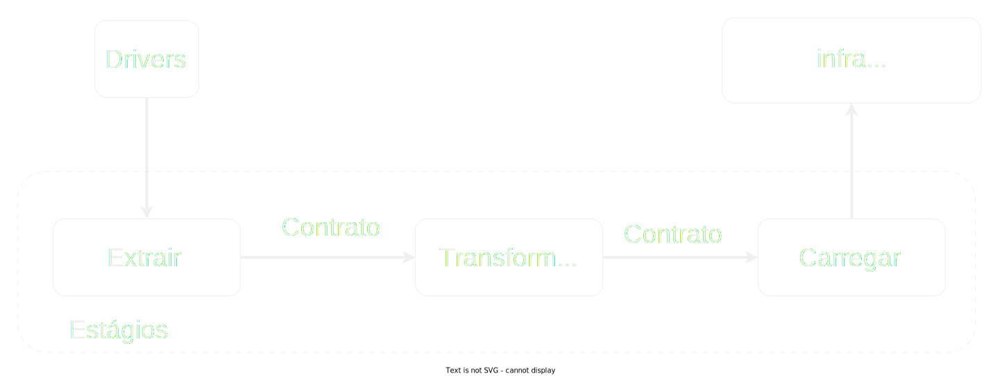
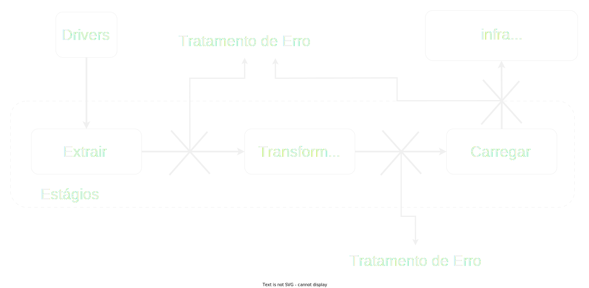
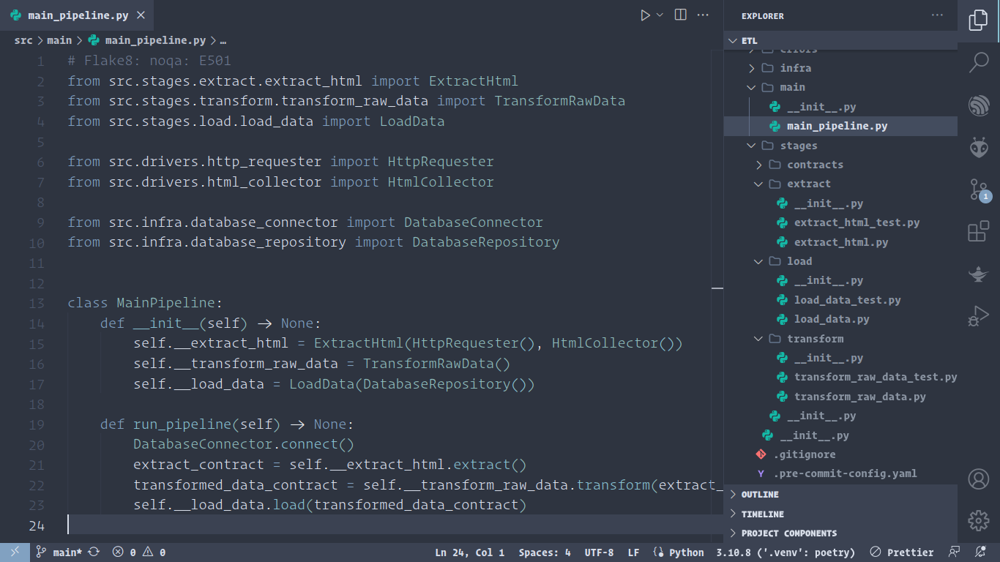

# Projeto ETL com Python

A Extração, Transformação e Carga (ETL) é um processo essencial no campo da gestão de dados e análise. Representando a base da preparação de dados para insights valiosos, a ETL envolve a extração de informações brutas de diferentes fontes de dados heterogêneas, seguida pela sua transformação em um formato coerente e útil. Durante essa fase de transformação, os dados são limpos, reformatados e enriquecidos para garantir a consistência e a qualidade necessárias. Finalmente, os dados preparados são carregados em um destino adequado, como um armazém de dados ou um sistema analítico, onde podem ser explorados e utilizados para tomada de decisões informadas. Através da ETL, a complexidade subjacente dos dados é simplificada, permitindo que as organizações alcancem uma compreensão mais profunda de suas operações e desempenho, impulsionando assim a eficiência e a estratégia empresarial.

## Estrutura do Projeto




## Tratamento de Erros




## Teste Unitário com Pytest

Os testes unitários desempenham um papel fundamental na garantia da qualidade e na robustez do código em projetos de desenvolvimento de software. O Pytest, uma popular estrutura de teste em Python, oferece uma abordagem simplificada e eficaz para a criação e execução desses testes. Com o Pytest, os desenvolvedores podem escrever casos de teste concisos e legíveis, que avaliam partes específicas do código, ou unidades, isoladamente. Esses testes podem verificar entradas, saídas e comportamentos esperados, revelando discrepâncias e falhas no código de maneira sistemática. Além disso, a capacidade do Pytest de identificar automaticamente e executar casos de teste através de convenções de nomenclatura intuitivas torna o processo de teste mais ágil e integrado ao fluxo de trabalho de desenvolvimento. Com sua ampla gama de recursos e suporte à parametrização, a estrutura Pytest capacita os desenvolvedores a construir software confiável e de alta qualidade, ao mesmo tempo em que facilita a manutenção contínua e a evolução do código-base.

## Estrutura

```
.
├── db.sql
├── etl_estrutura.svg
├── poetry.lock
├── pyproject.toml
├── README.md
├── requirements.txt
├── run.py
├── src
│   ├── drivers
│   ├── errors
│   ├── infra
│   ├── __init__.py
│   ├── main
│   ├── __pycache__
│   └── stages
└── tratar_error.svg

```


## Workspace VS Code


